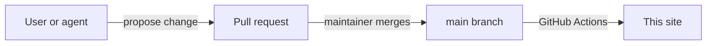

## Choose your path

### I want to get work done

- [Start your first chat](/getting-started#start-a-chat)
- [Rewrite and translate](/chat#rewrite-and-translate)
- [Ideas and prompts](/capture#prompts)
- [Workspaces](/workspaces#workspaces)
- [The board](/chat#the-board)

### I build and run agents

- [Create an agent](/agents-and-teams#create-something-new)
- [Model profiles](/models#model-profiles)
- [Agent Connectors](/tools#agent-connectors)
- [Schedules](/automation#schedules)
- [Hooks](/automation#hooks)

## All features

### Start here

- [Before you start](/getting-started#before-you-start)
- [Connect a model provider](/getting-started#connect-a-model-provider)
- [Start a chat](/getting-started#start-a-chat)
- [Pick up where you left off](/getting-started#pick-up-where-you-left-off)
- [Find your way around](/getting-started#find-your-way-around)

### Chat

- [The composer](/chat#the-composer)
- [Slash commands](/chat#slash-commands)
- [Rewrite and translate](/chat#rewrite-and-translate)
- [Message actions](/chat#message-actions)
- [Rich answers](/chat#rich-answers)
- [Manage threads](/chat#manage-threads)
- [The inspector](/chat#the-inspector)
- [The board](/chat#the-board)

### Agents and teams

- [Launch an agent](/agents-and-teams#launch-an-agent)
- [Create something new](/agents-and-teams#create-something-new)
- [Teams](/agents-and-teams#teams)
- [Take over](/agents-and-teams#take-over)

### Models and providers

- [Language Models](/models#language-models)
- [Model profiles](/models#model-profiles)
- [AI Powered features](/models#ai-powered-features)
- [Help on any setting](/models#help-on-any-setting)
- [Lab](/models#lab)

### Tools and connectors

- [Choose tools for a thread](/tools#choose-tools-for-a-thread)
- [Agent Connectors](/tools#agent-connectors)
- [Integrations](/tools#integrations)
- [Tool approvals](/tools#tool-approvals)
- [Approvals drawer](/tools#approvals-drawer)
- [HTML templates](/tools#html-templates)

### Automation

- [Schedules](/automation#schedules)
- [Hooks](/automation#hooks)

### Workspaces and terminal

- [Workspaces](/workspaces#workspaces)
- [Terminal](/workspaces#terminal)
- [Shell Environment](/workspaces#shell-environment)

### Ideas and prompts

- [Ideas](/capture#ideas)
- [Prompts](/capture#prompts)

### Personalization

- [Appearance](/personalization#appearance)
- [Theme Studio](/personalization#theme-studio)
- [Chat preferences](/personalization#chat-preferences)
- [Reset](/personalization#reset)

## How these docs change

Users and the AgentWorkX agent write these pages together. Each change arrives as a pull request, and a maintainer reviews it before it goes live. [Contribute on GitHub](https://github.com/robstove/agentworkx-docs).

