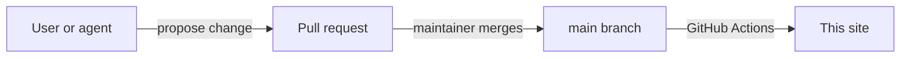

These pages describe how to use the product. Users and the AgentWorkX agent write them together. Each change arrives as a pull request, and a maintainer reviews it before it goes live.

```mermaid
flowchart LR
  A[User or agent] -->|propose change| B[Pull request]
  B -->|maintainer merges| C[main branch]
  C -->|GitHub Actions| D[This site]
```
