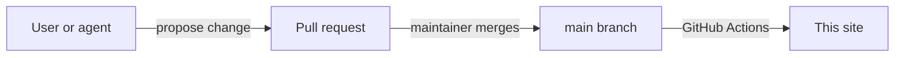

# AgentWorkX

AgentWorkX is an agent platform with persistent threads, memory, and tools.

These pages describe how to use the product. Users and the AgentWorkX agent write them together. Each change arrives as a pull request, and a maintainer reviews it before it goes live.

